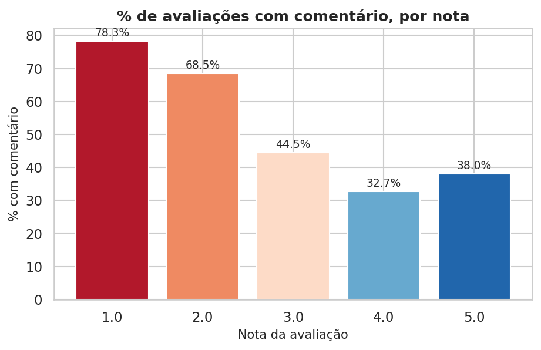
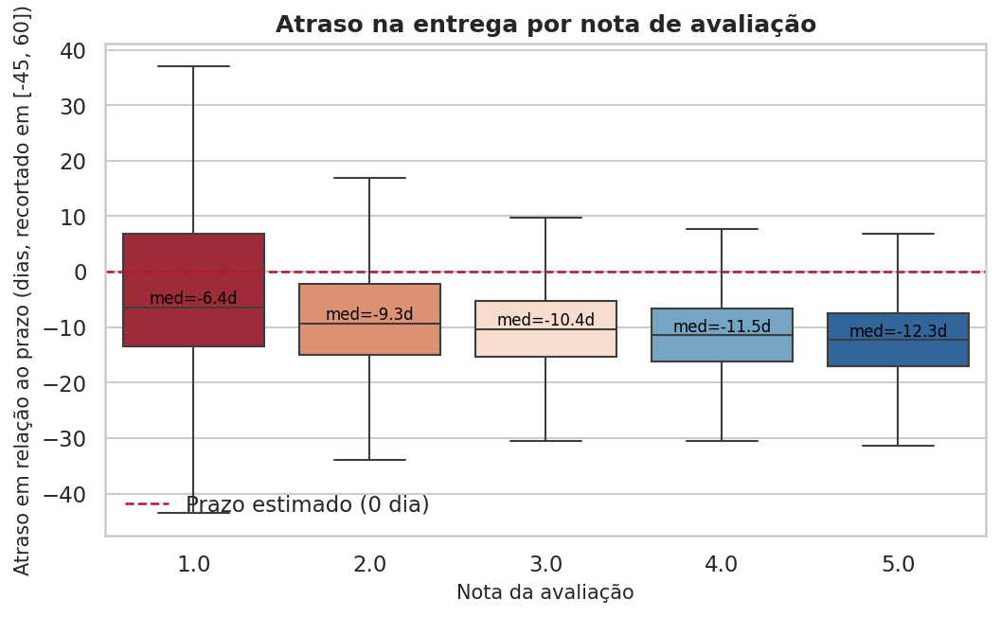
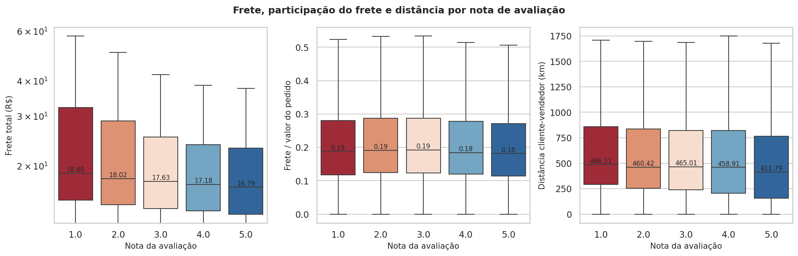
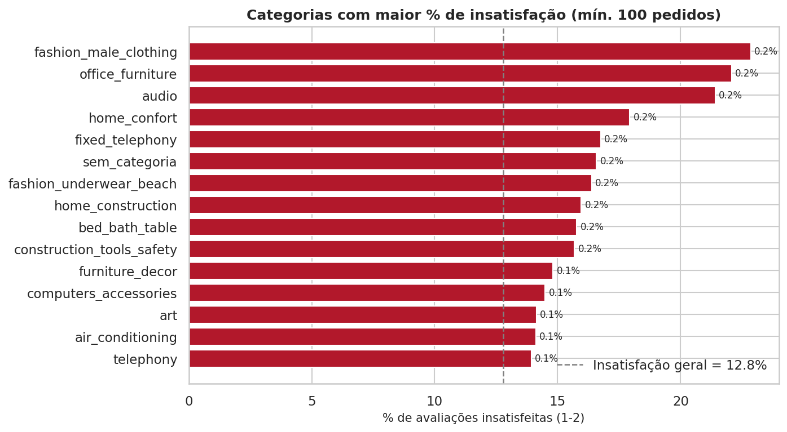
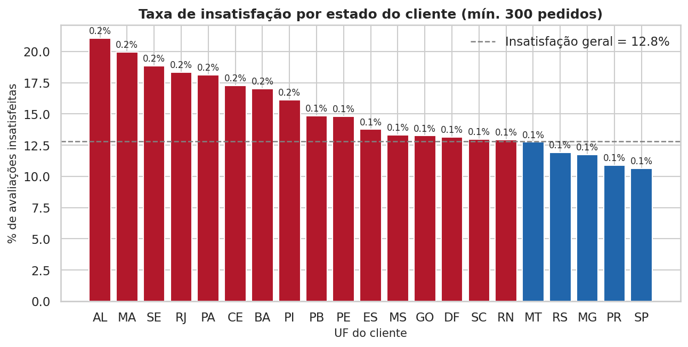

# Quais fatores estão associados à insatisfação dos clientes?

**Análise exploratória, testes de hipótese e modelo preditivo aplicados ao dataset
[Olist Brazilian E-commerce](https://www.kaggle.com/datasets/olistbr/brazilian-ecommerce)**

> **Pergunta de negócio:** *Quais fatores estão associados à insatisfação dos
> clientes e como essas evidências podem apoiar decisões de melhoria operacional?*

---

## 1. Sumário executivo

* **95.824 pedidos entregues com avaliação** compõem a base de análise; a taxa de
  insatisfação (notas 1-2) é de **12,8%** (nota média = 4,16).
* **O atraso na entrega é o fator mais associado à insatisfação:** enquanto
  4,2% dos clientes satisfeitos receberam com atraso,
  **33,7% dos insatisfeitos** receberam com atraso.
  Pedidos atrasados têm **11,6x mais chances** de gerar
  nota 1-2 (IC95% 11,0–12,2; p < 0,001).
* **Pedidos com múltiplos itens** são o segundo achado: 11,3% de
  insatisfação em pedidos com 1 item vs. **26,8% com 2+ itens**.
* **Frete, distância e categoria** associam-se à nota, porém com efeito **pequeno**
  (|r| ≤ 0,16 nos testes da Seção 5). Já a **forma de
  pagamento NÃO** se associou (p = 0,094).
* O modelo de classificação atinge **AUC = 0,767** (gradient boosting)
  e **AUC = 0,746** (regressão logística), permitindo estimar a
  *probabilidade de avaliação negativa* por pedido e priorizar ações.
* A interpretação das variáveis (Seção 7) sustenta recomendações operacionais
  concretas (Seção 8): gestão do **prazo prometido**, correção da operação de
  **pedidos fracionados**, auditoria em **categorias críticas** e uso do
  **score de risco** como alerta proativo ao cliente.
---

## 2. Dados e método

O dataset da Olist (marketplace brasileiro) traz **9 arquivos** relacionados por
`order_id`: pedidos, clientes, itens, avaliações, pagamentos, produtos, vendedores,
geolocalização e tradução de categorias.

**Critérios adotados**

| Decisão | Detalhe |
|---|---|
| Recorte analítico | Pedidos **entregues**, com data de entrega e **com avaliação** (1 review por pedido — a mais antiga) |
| Variável-alvo | `insatisfeito = 1` quando `review_score <= 2` (notas 1-2 vs. 3-5) |
| Granularidade | 1 linha = 1 pedido (pedido com múltiplos itens: total de itens/preço/frete + item principal = maior preço) |
| Variáveis-chave | Atraso vs. prazo prometido, tempo de entrega/manuseio, frete, valor, distância (geodésica CEP cliente × CEP vendedor), categoria, UF, forma de pagamento, sazonalidade |
| Vazamento | **Comentário da avaliação é excluído do modelo** (faz parte da própria avaliação); fica apenas na EDA |
| Reprodutibilidade | `random_state=42` em separação, CV e permutações |

**Volume da base de análise:** 95.824 pedidos · notas de 1 a 5 ·
53 grupos de categoria · 27 UFs.
---

## 3. EDA: pedidos e avaliações

A base completa tem **99.441 pedidos**; a maior parte chega ao cliente
(`delivered`), e pedidos cancelados/indisponíveis concentram avaliações ausentes.


*Figura: Status dos pedidos na base completa*

As notas concentram-se em **5** (59,2%),
mas notas **1** respondem por 9,8% —
mais do que 2 e 3 somadas (11,3%),
padrão típico de avaliações "ou amo muito, ou odeio".


*Figura: Distribuição das notas de avaliação*

No tempo, a insatisfação oscila mês a mês: o pior mês da série foi **2018-03**
(21,1% de notas 1-2) e o melhor **2017-08**
(9,5%), o que sugere efeitos de sazonalidade/capacidade
a monitorar.


*Figura: Evolução mensal da nota média e da insatisfação*

Ainda na EDA: avaliações com comentário são **76,0%** entre insatisfeitos
vs. **37,4%** entre satisfeitos — evidência de que o cliente insatisfeito
tende a *se manifestar* (sinal útil para monitoramento, embora observado após a nota).



*Figura: % de avaliações com comentário por nota*
---

## 4. Relação entre operação e nota

**Atraso.** A mediana do atraso piora conforme a nota cai: pedidos bem avaliados
chegam em média **12,2 dias antes** do prazo prometido,
enquanto os insatisfeitos têm apenas **7,2 dias de
antecedência** — e 33,7% deles ultrapassam o prazo de fato.



*Figura: Distribuição do atraso por nota de avaliação*

A taxa de insatisfação sobe de **10,2%**
(no prazo) para **78,4%**
(em atraso superior a 7 dias) — monotônica nas quatro faixas:


*Figura: Taxa de insatisfação por faixa de atraso*

**Pedidos com múltiplos itens.** Segundo achado em magnitude: pedidos com **1 item**
têm 11,3% de insatisfação, contra **26,8% em pedidos com
2 ou mais itens** — padrão compatível com envios fracionados/parciais.

**Frete, preço e distância.** Insatisfeitos pagam frete mais alto
(mediana R$ 18,52 vs. R$ 16,94) e vêm de
pedidos mais distantes (480 km vs. 426 km),
mas os efeitos são **pequenos**; a *participação* do frete no pedido é praticamente
igual entre os grupos (18,9% vs. 18,3%).



*Figura: Frete, participação do frete e distância por nota*

**Categorias e estados.** Existem categorias com insatisfação mais que o dobro da
média e estados com taxas distintas:



*Figura: Categorias com maior % de insatisfação*


*Figura: Taxa de insatisfação por estado do cliente*
---

## 5. Testes estatísticos de hipóteses

Com N ≈ 95.824, **pequenas diferenças se tornam "significativas"**; por isso
reportamos p-valor **e** tamanho de efeito. Hipóteses testadas (α = 0,05):

| # | Hipótese nula | Teste | Estatística | p-valor | Tamanho de efeito |
|---|---|---|---|---|---|
| 1 | Atraso (dias) — insatisfeitos x satisfeitos | Mann-Whitney U | 672843454.5 | < 1e-300 | correlação rank-bisserial (r) = 0.3133 |
| 2 | Tempo total de entrega (dias) | Mann-Whitney U | 702336842.0 | < 1e-300 | correlação rank-bisserial (r) = 0.3709 |
| 3 | Frete total (R$) | Mann-Whitney U | 596387722.0 | 7.18e-190 | correlação rank-bisserial (r) = 0.1641 |
| 4 | Participação do frete no pedido (%) | Mann-Whitney U | 524564383.5 | 1.86e-05 | correlação rank-bisserial (r) = 0.0239 |
| 5 | Valor do pedido (R$) | Mann-Whitney U | 566183785.0 | 4.20e-79 | correlação rank-bisserial (r) = 0.1051 |
| 6 | Nº de itens do pedido | Mann-Whitney U | 576676684.5 | < 1e-300 | correlação rank-bisserial (r) = 0.1256 |
| 7 | Distância cliente-vendedor (km) | Mann-Whitney U | 549227570.0 | 3.84e-49 | correlação rank-bisserial (r) = 0.0825 |
| 8 | Tempo até a postagem (dias) | Mann-Whitney U | 598118157.5 | 1.05e-197 | correlação rank-bisserial (r) = 0.1675 |
| 9 | Nota x atraso na entrega | Spearman (correlação de postos) | -0.1755 | < 1e-300 | rho de Spearman = -0.1755 |
| 10 | Nota x tempo total de entrega | Spearman (correlação de postos) | -0.2345 | < 1e-300 | rho de Spearman = -0.2345 |
| 11 | Nota x participação do frete | Spearman (correlação de postos) | -0.0306 | 2.46e-21 | rho de Spearman = -0.0306 |
| 12 | Nota x distância cliente-vendedor | Spearman (correlação de postos) | -0.0649 | 1.26e-89 | rho de Spearman = -0.0649 |
| 13 | Nota x valor do pedido | Spearman (correlação de postos) | -0.0395 | 1.77e-34 | rho de Spearman = -0.0395 |
| 14 | Cumprimento do prazo (sim/não) x insatisfação | Qui-quadrado de independência | 12688.16 | < 1e-300 | V de Cramér = 0.3639 |
| 15 | Categoria do produto x insatisfação | Qui-quadrado de independência | 472.1 | 4.66e-69 | V de Cramér = 0.0702 |
| 16 | UF do cliente x insatisfação | Qui-quadrado de independência | 719.71 | 5.31e-135 | V de Cramér = 0.0867 |
| 17 | Forma de pagamento x insatisfação | Qui-quadrado de independência | 6.39 | 9.40e-02 | V de Cramér = 0.0082 |
| 18 | Faixa de atraso x insatisfação | Qui-quadrado de independência | 15697.83 | < 1e-300 | V de Cramér = 0.4047 |
| 19 | Nota x faixa de atraso | Kruskal-Wallis | 9652.31 | < 1e-300 | epsilon² = 0.1007 |

**Leitura dos principais resultados**

* **Atraso e lentidão (efeitos moderados):** Mann-Whitney p < 0,001 com
  r = 0,313 no atraso (mediana
  -7,2 vs. -12,2 dias —
  insatisfeitos recebem com bem **menos antecedência**) e r = 0,371
  no tempo total de entrega (15,7 vs.
  9,9 dias).
* **Atraso × insatisfação (qui-quadrado + odds ratio):**

| medida                             | valor              |
|:-----------------------------------|:-------------------|
| Taxa de insatisfação — com atraso  | 54.06%             |
| Taxa de insatisfação — no prazo    | 9.21%              |
| Odds ratio (atrasado vs. no prazo) | 11.59              |
| IC 95% do odds ratio               | 11.02 – 12.19      |
| Risco relativo                     | 5.87x              |
| Qui-quadrado / p-valor             | 12688.2 / < 1e-300 |

  → ter atrasado multiplica por **11,6x** as chances de nota 1-2
  (54,1% de insatisfação entre atrasados vs.
  9,2% no prazo) — o maior efeito do estudo
  (V de Cramér = 0,364).
* **Categoria e UF** associam-se à insatisfação (qui-quadrado, p < 0,001), porém com
  **V de Cramér pequeno** (categoria = 0,070;
  UF = 0,087):
  efeitos reais, porém **diluídos** — servem para *onde* priorizar, não explicam o todo.
* **Forma de pagamento NÃO se associou** à insatisfação (p = 0,094;
  V = 0,008) — hipótese não rejeitada.
* **Correlações de Spearman** com a nota: atraso (ρ = -0,175) e
  tempo de entrega (ρ = -0,234)
  lideram; distância (ρ = -0,065),
  frete-ratio (ρ = -0,031) e
  valor (ρ = -0,040) têm
  associação **estatisticamente detectável, porém fraca**.
* **Kruskal-Wallis** entre faixas de atraso: p < 0,001 (epsilon² =
  0,1007).

_Tabelas completas:_ `reports/tables/tab05_testes_hipotese.csv` e `tab06_odds_ratio_atraso.csv`.
---

## 6. Modelo: probabilidade de avaliação negativa

**Configuração:** separação estratificada 80/20, validação cruzada estratificada
(5 dobras), `class_weight='balanced'` para a desbalanceada base (positivos =
12,8%). Features: 21
(variáveis operacionais + categoria/UF/pagamento/sazonealidade — **sem** texto de
comentário, para evitar vazamento).

| Modelo | AUC (CV) | AUC (teste) | PR-AUC (teste) | Precisão | Recall | F1 | Brier |
|---|---|---|---|---|---|---|---|
| Regressão logística | 0.741±0.004 | 0.746 | 0.396 | 0.284 | 0.602 | 0.386 | 0.191 |
| Gradient boosting (HGB) | 0.759±0.005 | **0.767** | 0.479 | 0.371 | 0.562 | 0.447 | 0.168 |

*Baseline do PR-AUC = taxa de positivos = 0.128. Melhor
modelo: **gradient boosting** (salvo em `outputs/modelo_insatisfacao.joblib`).*


*Figura: Curvas ROC e Precisão-Recall no conjunto de teste*


*Figura: Matriz de confusão do melhor modelo (limiar 0.5)*


*Figura: Calibração das probabilidades previstas*

A calibração é razoável — a probabilidade prevista é utilizável como **score de
risco** de insatisfação por pedido.
---

## 7. Interpretação das variáveis mais relevantes

Esta é a etapa central da análise: entender **o que de fato move a nota**.

### 7.1. Regressão logística — odds ratios

Lendo a tabela abaixo: `odds_ratio > 1` → **aumenta** a chance de nota 1-2;
`< 1` → **protege**. Para numéricos, o OR refere-se a 1 desvio-padrão de aumento.

**Fatores que MAIS aumentam a insatisfação (OR por desvio-padrão):**

| variavel                             |   odds_ratio |
|:-------------------------------------|-------------:|
| categoria: fashion_male_clothing     |         2.62 |
| entrega_dias                         |         2.10 |
| categoria: audio                     |         2.06 |
| UF vendedor: outros (agrupados)      |         1.74 |
| categoria: construction_tools_safety |         1.69 |
| categoria: art                       |         1.69 |

**Fatores protetores (maior associação com nota alta):**

| variavel                             |   odds_ratio |
|:-------------------------------------|-------------:|
| categoria: food_drink                |         0.12 |
| UF cliente: AP                       |         0.48 |
| categoria: books_general_interest    |         0.50 |
| categoria: construction_tools_lights |         0.56 |
| UF cliente: RR                       |         0.60 |
| UF vendedor: GO                      |         0.65 |

*Tabela completa:* `reports/tables/tab07_odds_ratios_logistica.csv`.

### 7.2. Gradient boosting — importância por permutação

A permutação mede **quanto o AUC cai** quando a variável é embaralhada
(variação média sobre 10 repetições no conjunto de teste):

| # | Variável | Queda média de AUC | Desvio |
|---|---|---|---|
| 1 | n_itens | 0.0573 | ±0.0021 |
| 2 | atraso_dias | 0.0452 | ±0.0015 |
| 3 | entrega_dias | 0.0341 | ±0.0032 |
| 4 | categoria_grupo | 0.0143 | ±0.0011 |
| 5 | manuseio_dias | 0.0074 | ±0.0018 |
| 6 | uf_vendedor | 0.0030 | ±0.0011 |
| 7 | n_fotos | 0.0027 | ±0.0004 |
| 8 | distancia_km | 0.0025 | ±0.0005 |


*Figura: Dependência parcial — atraso, frete e distância*


*Figura: Importância média |SHAP| — contribuição de cada variável*


*Figura: SHAP beeswarm — direção e magnitude do efeito de cada variável*

### 7.3. Síntese das variáveis mais relevantes

1. **Prazo de entrega (atraso vs. prometido)** — maior efeito *univariado*:
   11,6x mais chances de nota 1-2 com atraso, relação
   dose-resposta (10,2%
   → 78,4% nas faixas) e
   #2 em importância de permutação. A dependência parcial confirma o formato do efeito.
2. **Tempo total de entrega (lentidão percebida)** — #1 na permutação da regressão
   logística e #3 no boosting; maior efeito Mann-Whitney do estudo (r =
   0,37): 15,7 dias
   (insatisfeitos) vs. 9,9 dias (satisfeitos);
   OR = 2,1 por desvio-padrão.
3. **Pedidos com múltiplos itens** — **#1 em importância de permutação** no boosting:
   11,3% de insatisfação com 1 item vs. 26,8% com 2+.
   Provável reflexo de envios fracionados/parciais — alavanca operacional direta.
4. **Categoria do produto** — #4 em permutação, com extremos nítidos na logística:
   `fashion_male_clothing` com OR = 2,6x
   e `food_drink` com OR = 0,12x
   (proteção).
5. **Frete total e distância** — associação **consistente, porém pequena**
   (r = 0,16 e
   0,08);
   a *participação* do frete no pedido é praticamente nula (r =
   0,02).
6. **Manuseio (compra → postagem)** — efeito pequeno e residual (permutação 0,007;
   r = 0,17).
7. **UF do cliente** — moderador com efeito pequeno (V = 0,09;
   ex.: `uf_cliente_RJ` com OR = 1,4x).
8. **O que NÃO explica a nota:** a **forma de pagamento** não teve associação
   (p = 0,094) e a
   sazonalidade contribui de forma residual.
---

## 8. Recomendações gerenciais (tradução das evidências)

**R1 — Gestão ativa do prazo prometido (prioridade máxima).**
Com 11,6x mais chances de insatisfação em atrasos e
33,7% dos insatisfeitos terem recebido com atraso, a alavanca de
maior retorno é: (i) revisar o *prometido x executado* por rota/transportadora,
(ii) antecipar aviso proativo ao cliente quando o risco de atraso aparecer
(usar o score do modelo, Seção 6) e (iii) negociar prazos realistas junto aos
vendedores/regiões mais lentos.

**R2 — Corrigir a operação de pedidos com múltiplos itens.**
Pedidos com 2+ itens têm 26,8% de insatisfação vs. 11,3%
com 1 item — e é a variável de **maior importância no modelo**. Ações: rastrear
envios fracionados/parciais item a item, unificar envio quando possível e
comunicar proativamente quando uma parte do pedido atrasar.

**R3 — Atuação cirúrgica em categorias críticas.**
* **fashion_male_clothing**: 22,9% de insatisfação (n=105)
* **office_furniture**: 22,1% de insatisfação (n=1.241)
* **audio**: 21,4% de insatisfação (n=341)
* **home_confort**: 17,9% de insatisfação (n=368)
* **fixed_telephony**: 16,8% de insatisfação (n=209)
Auditar sellers, qualidade de embalagem e prazos dessas categorias; comparar com
a média geral (12,8%).

**R4 — Frete: alavanca secundária (não priorizar sobre prazo/item).**
Insatisfeitos pagam frete um pouco mais alto (mediana R$ 18,52 vs.
R$ 16,94), mas o efeito é **pequeno** e a participação do frete
no pedido é igual entre grupos — portanto, frete grátis isolado não resolve a
insatisfação; atuar apenas onde ele se cruza com atraso (rotas longas).

**R5 — Monitoramento contínuo por região e tempo.**
* **AL**: 21,1% (n=394)
* **MA**: 19,9% (n=712)
* **SE**: 18,9% (n=334)
* Pior mês 2018-03 vs. melhor mês 2017-08 — planejar capacidade nas janelas de pico.

**R6 — Usar o modelo como sistema de alerta.**
Com AUC ≈ 0,77 e calibração razoável, operar:
(a) score de risco por pedido **no momento da entrega**,
(b) atendimento proativo dos casos acima de limiar (priorizar por recall/precisão
conforme capacidade da equipe) e
(c) *fechamento do ciclo*: acompanhar a taxa de nota 1-2 dos pedidos intervidos.

**R7 — Escuta ativa pós-entrega.**
76,0% dos insatisfeitos escrevem comentário — tratar comentários/keywords
negativos como *sinal de alerta secundário* (monitoramento de reputação), sabendo
que o alerta mais barato é o **atraso**, que já é conhecido **antes** do cliente reclamar.
---

## 9. Limitações e próximos passos

* **Associação ≠ causalidade:** dados observacionais; confundidores possíveis
  (categoria × vendedor × região) — próximo passo: modelos com efeitos aleatórios
  ou experimentação (ex.: teste de promessa de prazo).
* **Sem conteúdo textual:** comentários não entram no modelo (vazamento); NLP
  (sentimento/tópicos) pode somar na triagem.
* **Sem info de devoluções/logística reversa** no dataset.
* Classificação com limiar 0,5 — calibrar conforme capacidade de atendimento
  (curva precisão×recall) na operação.
* Próximos passos sugeridos: monitorar drift mensal do modelo; adicionar
  tempo-de-vida do cliente (recompra) e avaliação por item; segmentar o
  score por transportadora.

## 10. Reprodutibilidade

```bash
pip install -r requirements.txt
python run_pipeline.py              # roda todas as etapas (load → eda → tests → model → etapas → report)
python run_pipeline.py --etapa eda  # executa apenas uma etapa
```

*Dados:* Kaggle — `olistbr/brazilian-ecommerce` (baixados automaticamente via
`kagglehub` ou em `data/raw/`). *Seed:* 42.

**Artefatos:** `reports/relatorio_etapas.md` (passo a passo por etapa) ·
`reports/figures/` (16 figuras) ·
`reports/tables/` (14 tabelas) ·
`outputs/analysis_dataset.csv` · `outputs/resultados_modelo.json` ·
`outputs/modelo_insatisfacao.joblib`.
