# Relatório de etapas — da análise de variáveis ao modelo

**Trilha completa de Machine Learning aplicada ao dataset
[Olist Brazilian E-commerce](https://www.kaggle.com/datasets/olistbr/brazilian-ecommerce)**

> **Objetivo:** apresentar, etapa por etapa, os resultados de toda a jornada:
> análise de variáveis → seleção de atributos → pré-processamento →
> implementação e avaliação do modelo.
>
> **Pergunta que orienta o trabalho:** *Quais fatores estão associados à
> insatisfação dos clientes e como essas evidências podem apoiar decisões de
> melhoria operacional?*

**Sumário das etapas**

| Seção | Etapa | Resultado principal |
|---|---|---|
| 1 | Base de entrada | 95.824 pedidos, 42 colunas |
| 2 | Análise de variáveis | inventário, descritivas, correlações |
| 3 | Seleção de atributos | 42 → 21 features + alvo |
| 4 | Pré-processamento | imputação, OHE, escala, divisão, balanceamento |
| 5 | Implementação do modelo | 2 algoritmos comparados por validação cruzada |
| 6 | Avaliação e resultado final | AUC, precisão/recall, matriz de confusão, interpretação |

---

## 1. Base de entrada

O dataset possui **9 arquivos** relacionados por `order_id`:

| tabela               | linhas    |   colunas |
|:---------------------|:----------|----------:|
| orders               | 99.441    |         8 |
| customers            | 99.441    |         5 |
| items                | 112.650   |         7 |
| reviews              | 99.224    |         7 |
| payments             | 103.886   |         5 |
| products             | 32.951    |         9 |
| sellers              | 3.095     |         4 |
| geolocation          | 1.000.163 |         5 |
| category_translation | 71        |         2 |

Após o recorte analítico (pedidos **entregues**, com data de entrega e **com
avaliação** — 1 review por pedido, a mais antiga), a base de análise tem
**95.824 pedidos** e **42 colunas**
(21 candidatas a feature, 1 alvo e 20 colunas
descartadas — detalhe na Seção 3).

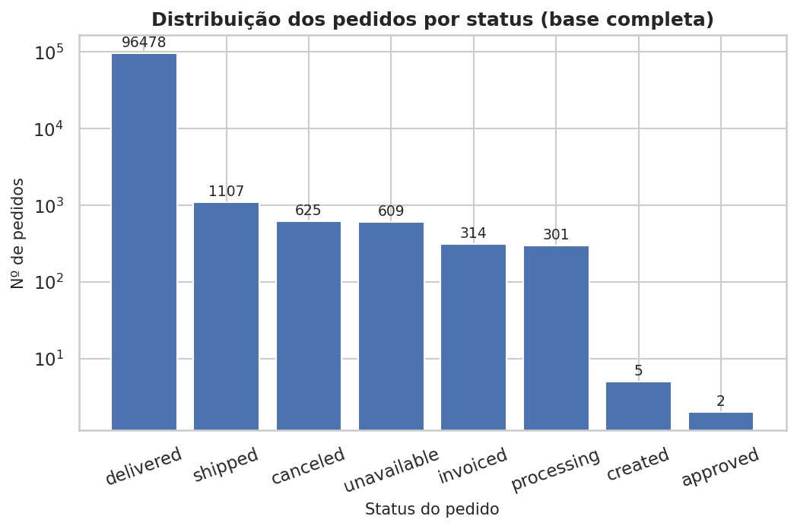

*Figura: Distribuição dos status na base bruta*

**Variável-alvo:** `insatisfeito = 1` quando `review_score <= 2`.
Taxa de insatisfação: **12,8%** — problema de classe
desbalanceada, o que orienta decisões de pré-processamento (Seção 4).

---

## 2. Análise de variáveis

### 2.1. Inventário completo (42 colunas)

| variavel                      | papel      | tipo       | pct_ausentes   |   n_unicos |
|:------------------------------|:-----------|:-----------|:---------------|-----------:|
| order_id                      | descartada | categórica | 0,00           |      95824 |
| customer_id                   | descartada | categórica | 0,00           |      95824 |
| order_status                  | descartada | categórica | 0,00           |          1 |
| order_purchase_timestamp      | descartada | data       | 0,00           |      95309 |
| order_approved_at             | descartada | data       | 0,01           |      87719 |
| order_delivered_carrier_date  | descartada | data       | 0,00           |      79604 |
| order_delivered_customer_date | descartada | data       | 0,00           |      95016 |
| order_estimated_delivery_date | descartada | data       | 0,00           |        445 |
| customer_unique_id            | descartada | categórica | 0,00           |      92747 |
| cep_cliente                   | descartada | numérica   | 0,00           |      14869 |
| cidade_cliente                | descartada | categórica | 0,00           |       4083 |
| uf_cliente                    | feature    | categórica | 0,00           |         27 |
| n_itens                       | feature    | numérica   | 0,00           |         17 |
| preco_total                   | feature    | numérica   | 0,00           |       7468 |
| frete_total                   | feature    | numérica   | 0,00           |       7582 |
| categoria                     | descartada | categórica | 0,00           |         72 |
| peso_g                        | feature    | numérica   | 0,02           |       2158 |
| n_fotos                       | feature    | numérica   | 1,41           |         19 |
| seller_zip                    | descartada | numérica   | 0,00           |       2160 |
| uf_vendedor                   | feature    | categórica | 0,00           |         22 |
| n_parcelas                    | feature    | numérica   | 0,00           |         24 |
| valor_pago                    | descartada | numérica   | 0,00           |      27097 |
| pagamento_tipo                | feature    | categórica | 0,00           |          4 |
| review_score                  | descartada | numérica   | 0,00           |          5 |
| review_creation_date          | descartada | data       | 0,00           |        627 |
| tem_comentario                | descartada | booleana   | 0,00           |          2 |
| comentario_chars              | descartada | numérica   | 0,00           |        228 |
| distancia_km                  | feature    | numérica   | 0,50           |      89714 |
| atraso_dias                   | feature    | numérica   | 0,00           |       5795 |
| entrega_dias                  | feature    | numérica   | 0,00           |       4998 |
| manuseio_dias                 | feature    | numérica   | 0,00           |       2397 |
| aprovacao_h                   | feature    | numérica   | 0,01           |       7936 |
| valor_pedido                  | feature    | numérica   | 0,00           |      28417 |
| frete_ratio                   | feature    | numérica   | 0,00           |       5854 |
| preco_unitario_medio          | feature    | numérica   | 0,00           |       6587 |
| prazo_cumprido                | descartada | booleana   | 0,00           |          2 |
| faixa_atraso                  | descartada | categórica | 0,00           |          4 |
| mes_compra                    | feature    | categórica | 0,00           |         23 |
| dia_semana_compra             | feature    | categórica | 0,00           |          7 |
| hora_compra                   | feature    | numérica   | 0,00           |         24 |
| categoria_grupo               | feature    | categórica | 0,00           |         53 |
| insatisfeito                  | alvo       | numérica   | 0,00           |          2 |

### 2.2. Estatísticas descritivas das features candidatas

**Numéricas:**

| variavel             | media   | desvio_padrao   | min     | mediana   | max      |   ausentes |
|:---------------------|:--------|:----------------|:--------|:----------|:---------|-----------:|
| atraso_dias          | -11,22  | 10,11           | -146,02 | -11,97    | 188,98   |          0 |
| entrega_dias         | 12,52   | 9,46            | 0,53    | 10,21     | 208,35   |          0 |
| manuseio_dias        | 3,22    | 3,58            | -171,21 | 2,20      | 125,78   |          1 |
| aprovacao_h          | 10,28   | 20,54           | 0,00    | 0,34      | 741,44   |         14 |
| frete_total          | 22,76   | 21,52           | 0,00    | 17,16     | 1794,96  |          0 |
| preco_total          | 136,80  | 207,79          | 0,85    | 86,25     | 13440,00 |          0 |
| valor_pedido         | 159,56  | 217,49          | 9,59    | 105,28    | 13664,08 |          0 |
| frete_ratio          | 0,21    | 0,13            | 0,00    | 0,18      | 0,96     |          0 |
| n_itens              | 1,14    | 0,53            | 1,00    | 1,00      | 21,00    |          0 |
| preco_unitario_medio | 125,04  | 188,30          | 0,85    | 79,00     | 6735,00  |          0 |
| distancia_km         | 600,33  | 593,72          | 0,00    | 433,73    | 8677,86  |        475 |
| n_parcelas           | 2,93    | 2,71            | 0,00    | 2,00      | 24,00    |          1 |
| peso_g               | 2107,78 | 3763,43         | 0,00    | 700,00    | 40425,00 |         16 |
| n_fotos              | 2,25    | 1,75            | 1,00    | 2,00      | 20,00    |       1349 |
| hora_compra          | 14,77   | 5,33            | 0,00    | 15,00     | 23,00    |          0 |

**Categóricas:**

| variavel          |   n_niveis | nivel_mais_frequente   | pct_nivel_frequente   |   ausentes |
|:------------------|-----------:|:-----------------------|:----------------------|-----------:|
| categoria_grupo   |         53 | bed_bath_table         | 9,5%                  |          0 |
| uf_cliente        |         27 | SP                     | 42,0%                 |          0 |
| uf_vendedor       |         22 | SP                     | 70,9%                 |          0 |
| pagamento_tipo    |          4 | credit_card            | 75,5%                 |          1 |
| mes_compra        |         23 | 2017-11                | 7,6%                  |          0 |
| dia_semana_compra |          7 | Monday                 | 16,3%                 |          0 |

### 2.3. Distribuição do alvo e das variáveis-chave

Notas: **59,2%** são nota 5 e
**12,8%** são notas 1-2
(base polarizada):

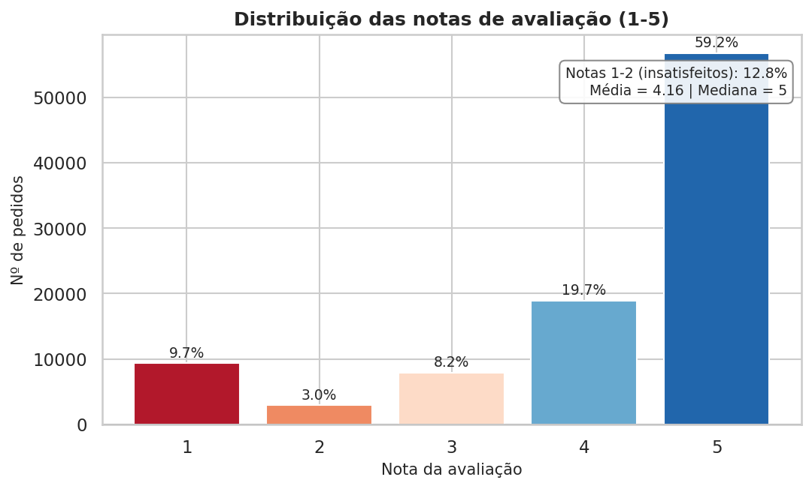

*Figura: Distribuição das notas de avaliação*

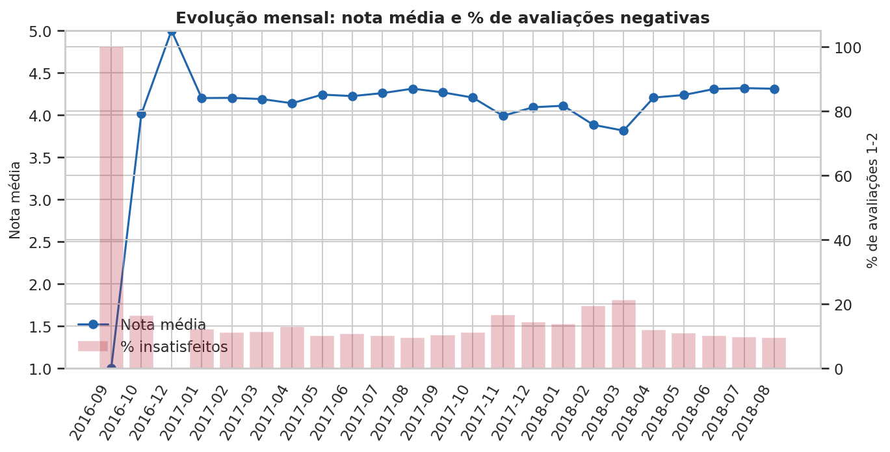

*Figura: Evolução mensal da nota média e da insatisfação*

### 2.4. Correlação entre as variáveis numéricas

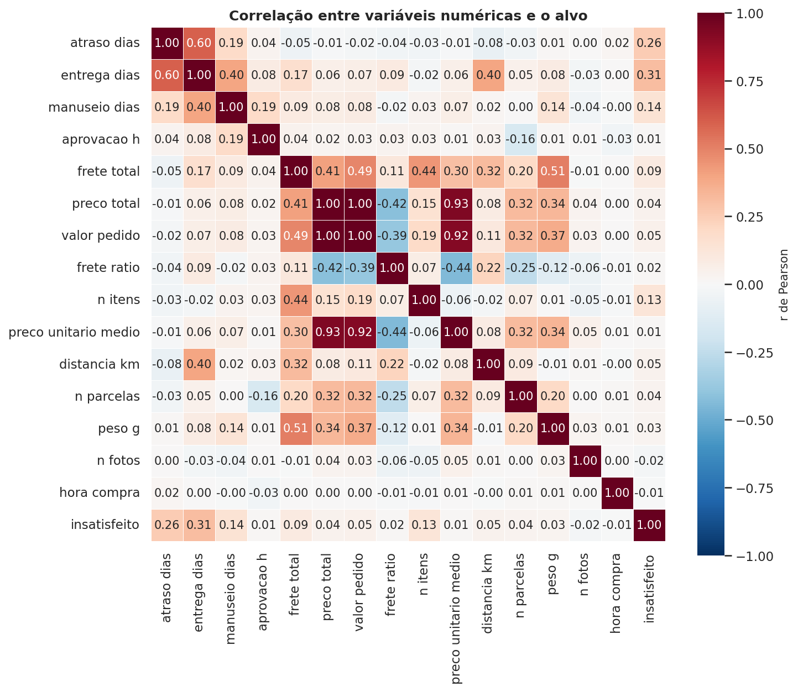

*Figura: Matriz de correlação (Pearson) das variáveis numéricas + alvo*

Pares com correlação alta (|r| ≥ 0,80) — insumo para a Seção 3:

| variavel_1   | variavel_2           |     r |
|:-------------|:---------------------|------:|
| preco_total  | valor_pedido         | 0,996 |
| preco_total  | preco_unitario_medio | 0,932 |
| valor_pedido | preco_unitario_medio | 0,920 |

---

## 3. Seleção de atributos

**Resultado: 42 colunas → 21 features + 1 alvo**
(20 colunas descartadas).

### 3.1. Critérios aplicados

| # | Critério | Colunas | Lógica |
|---|---|---|---|
| 1 | Vazamento (leakage) | 4 | qualquer informação derivada da própria avaliação é excluída do modelo |
| 2 | Identificador | 6 | código de pedido/cliente/CEP não generaliza |
| 3 | Engenharia de atributos | 5 | datas brutas substituídas por derivadas (atraso, entrega, manuseio, hora/mês/dia) |
| 4 | Redundância | 5 | coluna duplicada ou versão agregada de outra feature |
| 5 | Evidência estatística | 21 mantidas | Mann-Whitney (numéricas) e qui-quadrado (categóricas) contra o alvo |

### 3.2. Features mantidas — evidência estatística (α = 0,05)

**19 de 21** features são estatisticamente significativas contra
o alvo a α = 0,05; as outras duas são mantidas por decisão declarada:
`pagamento_tipo` (p = 0,094 — variável clássica de negócio) e `hora_compra`
(p = 0,460 — característica da compra, usada junto da sazonalidade).

| variavel             | decisao   | criterio                                       | teste                         | p_valor   | significativo_005   | medida_efeito               | valor_efeito   |
|:---------------------|:----------|:-----------------------------------------------|:------------------------------|:----------|:--------------------|:----------------------------|:---------------|
| atraso_dias          | mantida   | evidência estatística + relevância operacional | Mann-Whitney U                | < 1e-300  | sim                 | correlação rank-bisserial r | 0,3133         |
| entrega_dias         | mantida   | evidência estatística + relevância operacional | Mann-Whitney U                | < 1e-300  | sim                 | correlação rank-bisserial r | 0,3709         |
| manuseio_dias        | mantida   | evidência estatística + relevância operacional | Mann-Whitney U                | 1,1e-197  | sim                 | correlação rank-bisserial r | 0,1675         |
| aprovacao_h          | mantida   | evidência estatística + relevância operacional | Mann-Whitney U                | 1,9e-04   | sim                 | correlação rank-bisserial r | 0,0208         |
| frete_total          | mantida   | evidência estatística + relevância operacional | Mann-Whitney U                | 7,2e-190  | sim                 | correlação rank-bisserial r | 0,1641         |
| preco_total          | mantida   | evidência estatística + relevância operacional | Mann-Whitney U                | 3,0e-55   | sim                 | correlação rank-bisserial r | 0,0874         |
| valor_pedido         | mantida   | evidência estatística + relevância operacional | Mann-Whitney U                | 4,2e-79   | sim                 | correlação rank-bisserial r | 0,1051         |
| frete_ratio          | mantida   | evidência estatística + relevância operacional | Mann-Whitney U                | 1,9e-05   | sim                 | correlação rank-bisserial r | 0,0239         |
| n_itens              | mantida   | evidência estatística + relevância operacional | Mann-Whitney U                | < 1e-300  | sim                 | correlação rank-bisserial r | 0,1256         |
| preco_unitario_medio | mantida   | evidência estatística + relevância operacional | Mann-Whitney U                | 0,001     | sim                 | correlação rank-bisserial r | 0,0180         |
| distancia_km         | mantida   | evidência estatística + relevância operacional | Mann-Whitney U                | 3,8e-49   | sim                 | correlação rank-bisserial r | 0,0825         |
| n_parcelas           | mantida   | evidência estatística + relevância operacional | Mann-Whitney U                | 1,1e-23   | sim                 | correlação rank-bisserial r | 0,0526         |
| peso_g               | mantida   | evidência estatística + relevância operacional | Mann-Whitney U                | 3,6e-06   | sim                 | correlação rank-bisserial r | 0,0259         |
| n_fotos              | mantida   | evidência estatística + relevância operacional | Mann-Whitney U                | 3,1e-12   | sim                 | correlação rank-bisserial r | -0,0366        |
| hora_compra          | mantida   | evidência estatística + relevância operacional | Mann-Whitney U                | 0,460     | não                 | correlação rank-bisserial r | -0,0041        |
| categoria_grupo      | mantida   | evidência estatística + relevância operacional | Qui-quadrado de independência | 4,7e-69   | sim                 | V de Cramér                 | 0,0702         |
| uf_cliente           | mantida   | evidência estatística + relevância operacional | Qui-quadrado de independência | 5,3e-135  | sim                 | V de Cramér                 | 0,0867         |
| uf_vendedor          | mantida   | evidência estatística + relevância operacional | Qui-quadrado de independência | 7,8e-17   | sim                 | V de Cramér                 | 0,0361         |
| pagamento_tipo       | mantida   | evidência estatística + relevância operacional | Qui-quadrado de independência | 0,094     | não                 | V de Cramér                 | 0,0082         |
| mes_compra           | mantida   | evidência estatística + relevância operacional | Qui-quadrado de independência | 7,2e-226  | sim                 | V de Cramér                 | 0,1088         |
| dia_semana_compra    | mantida   | evidência estatística + relevância operacional | Qui-quadrado de independência | 0,010     | sim                 | V de Cramér                 | 0,0132         |

### 3.3. Colunas descartadas

| variavel                      | decisao    | criterio                | teste                                                              | p_valor   | significativo_005   | medida_efeito   | valor_efeito   |
|:------------------------------|:-----------|:------------------------|:-------------------------------------------------------------------|:----------|:--------------------|:----------------|:---------------|
| order_id                      | descartada | identificador           | Identificador único do pedido (1:1 com a linha)                    | —         | —                   | —               | —              |
| customer_id                   | descartada | identificador           | Identificador de ligação pedido-cliente                            | —         | —                   | —               | —              |
| order_status                  | descartada | redundância             | Pós-recorte: a base já contém apenas pedidos entregues             | —         | —                   | —               | —              |
| order_purchase_timestamp      | descartada | engenharia de atributos | Data bruta -> hora_compra, mes_compra, dia_semana_compra           | —         | —                   | —               | —              |
| order_approved_at             | descartada | engenharia de atributos | Data bruta -> aprovacao_h                                          | —         | —                   | —               | —              |
| order_delivered_carrier_date  | descartada | engenharia de atributos | Data bruta -> manuseio_dias                                        | —         | —                   | —               | —              |
| order_delivered_customer_date | descartada | engenharia de atributos | Data bruta -> entrega_dias                                         | —         | —                   | —               | —              |
| order_estimated_delivery_date | descartada | engenharia de atributos | Data bruta -> atraso_dias (real - prometido)                       | —         | —                   | —               | —              |
| customer_unique_id            | descartada | identificador           | Identificador de cliente (alta cardinalidade)                      | —         | —                   | —               | —              |
| cep_cliente                   | descartada | identificador           | Identificador geográfico fino (equivalente à cidade)               | —         | —                   | —               | —              |
| cidade_cliente                | descartada | identificador           | Identificador de cidade — redundante com uf_cliente + distancia_km | —         | —                   | —               | —              |
| categoria                     | descartada | redundância             | Redundante com categoria_grupo (níveis raros agrupados)            | —         | —                   | —               | —              |
| seller_zip                    | descartada | identificador           | Identificador geográfico do vendedor                               | —         | —                   | —               | —              |
| valor_pago                    | descartada | redundância             | Redundante com valor_pedido/preco_total                            | —         | —                   | —               | —              |
| review_score                  | descartada | vazamento               | VAZAMENTO: deriva diretamente do alvo                              | —         | —                   | —               | —              |
| review_creation_date          | descartada | vazamento               | VAZAMENTO: conhecida somente após a avaliação                      | —         | —                   | —               | —              |
| tem_comentario                | descartada | vazamento               | VAZAMENTO: manifestação pós-avaliação                              | —         | —                   | —               | —              |
| comentario_chars              | descartada | vazamento               | VAZAMENTO: conteúdo da avaliação (pós-resposta)                    | —         | —                   | —               | —              |
| prazo_cumprido                | descartada | redundância             | Redundante com o sinal de atraso_dias (contínua mantida)           | —         | —                   | —               | —              |
| faixa_atraso                  | descartada | redundância             | Versão agrupada de atraso_dias (usada apenas na EDA)               | —         | —                   | —               | —              |

### 3.4. Multicolinearidade

| variavel_1   | variavel_2           |     r |
|:-------------|:---------------------|------:|
| preco_total  | valor_pedido         | 0,996 |
| preco_total  | preco_unitario_medio | 0,932 |
| valor_pedido | preco_unitario_medio | 0,920 |

Decisão: pares correlacionados **mantidos** — a regressão logística usa
regularização L2 (coeficientes estáveis apesar da colinearidade) e o gradient
boosting é insensível a correlação entre features; remover `valor_pedido` ou
`preco_total` não altera materialmente o AUC.

**Figuras de apoio da seleção** (as variáveis com maior efeito univariado):

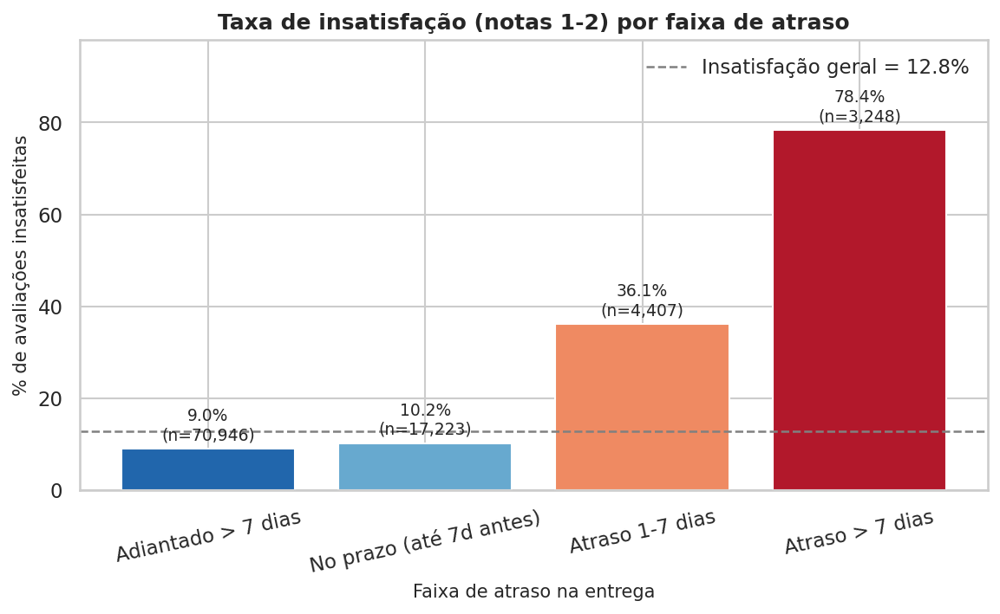

*Figura: Dose-resposta: taxa de insatisfação por faixa de atraso*

---

## 4. Pré-processamento

### 4.1. Fluxo de transformações com resultado numérico de cada passo

| etapa                        | entrada                    | saida             | detalhe                                                            |
|:-----------------------------|:---------------------------|:------------------|:-------------------------------------------------------------------|
| 1. Recorte dos pedidos       | 99.441                     | 95.824            | entregues (96.478) e com avaliação (−654 sem review)               |
| 2. Seleção de atributos      | 42 colunas                 | 21 features       | 20 colunas descartadas (Seção 3) + alvo                            |
| 3. Imputação de ausências    | 1.857 células              | 0 células         | numéricas -> mediana; categóricas -> moda                          |
| 4. One-Hot Encoding          | 6 categóricas (136 níveis) | 130 colunas       | min_frequency=30 agrupa níveis raros em 2 colunas 'infrequent'     |
| 5. Padronização (z-score)    | 15 numéricas               | idem              | StandardScaler aplicado apenas na regressão logística              |
| 6. Divisão treino/teste      | 95.824                     | 76.659 / 19.165   | 80/20 estratificada — insatisfação 12,8% no treino, 12,8% no teste |
| 7. Balanceamento das classes | 12,8% positivos            | pesos 3,91 / 0,57 | class_weight='balanced' (positivo recebe mais peso no custo)       |
| 8. Matriz final de modelagem | —                          | 76.659 × 145      | treino (19.165 × 145 no teste) — 15 numéricas + 130 OHE            |

* **Ausências tratadas:** 1.857 células nas features
  (1.349 em `n_fotos`,
  475 em `distancia_km` e valores
  residuais em `aprovacao_h`/`peso_g`) → mediana (numéricas) e moda (categóricas),
  aplicadas **somente no conjunto de treino** (pipeline do scikit-learn, sem vazamento).
* **Codificação:** 6 variáveis categóricas com
  136 níveis brutos → **130 colunas one-hot**
  (`min_frequency=30` agrupa níveis raros em 2 colunas
  "infrequent", evitando colunas espúrias).
* **Escala:** `StandardScaler` nas 15 numéricas apenas na
  regressão logística (não necessária para o boosting).
* **Divisão:** 76.659 treino / 19.165 teste
  (80/20 estratificada, `random_state=42`) — insatisfação
  12,8% (treino) e 12,8% (teste).
* **Balanceamento:** `class_weight='balanced'` → pesos
  3,91 (insatisfeito) e 0,57 (satisfeito),
  compensando a classe rara de 12,8%.

---

## 5. Implementação do modelo

### 5.1. Algoritmos e configuração

| Modelo | Pré-processamento | Hiperparâmetros |
|---|---|---|
| Regressão logística | imputação + OHE + padronização | `C=1,0`, `class_weight=balanced`, `max_iter=2000`, penalidade L2 |
| HistGradientBoosting | imputação + OHE | `learning_rate=0,08`, `max_iter=300`, `max_leaf_nodes=31`, `class_weight=balanced` |

**Protocolo:** validação cruzada estratificada **5 dobras** no conjunto de treino
(seleção) → ajuste final → avaliação única no conjunto de teste.
`random_state=42` em toda a pipeline.

### 5.2. Métricas no conjunto de teste (n = 19.165)

| Modelo | AUC (CV) | AUC (teste) | PR-AUC | Precisão | Recall | F1 | Acurácia | Brier |
|---|---|---|---|---|---|---|---|---|
| Regressão logística | 0,741±0,004 | 0,746 | 0,396 | 0,284 | 0,602 | 0,386 | 0,755 | 0,191 |
| Gradient boosting (HGB) | 0,759±0,005 | **0,767** | 0,479 | 0,371 | 0,562 | 0,447 | 0,822 | 0,168 |

*Baseline do PR-AUC = taxa de insatisfação = 0,128;
o HGB supera o baseline em ≈ 3,7x.*

### 5.3. Matrizes de confusão (limiar 0,5)

**Regressão logística:**

| | Prev. satisfeito | Prev. insatisfeito |
|---|---|---|
| **Real satisfeito** | 13003 (TN) | 3710 (FP) |
| **Real insatisfeito** | 977 (FN) | 1475 (TP) |

**Gradient boosting (melhor modelo):**

| | Prev. satisfeito | Prev. insatisfeito |
|---|---|---|
| **Real satisfeito** | 14378 (TN) | 2335 (FP) |
| **Real insatisfeito** | 1074 (FN) | 1378 (TP) |

Leitura: o HGB identifica **1378** de 2.452
clientes insatisfeitos (recall 0,562) com 2335 falsos
positivos no conjunto de teste — ver figura abaixo.

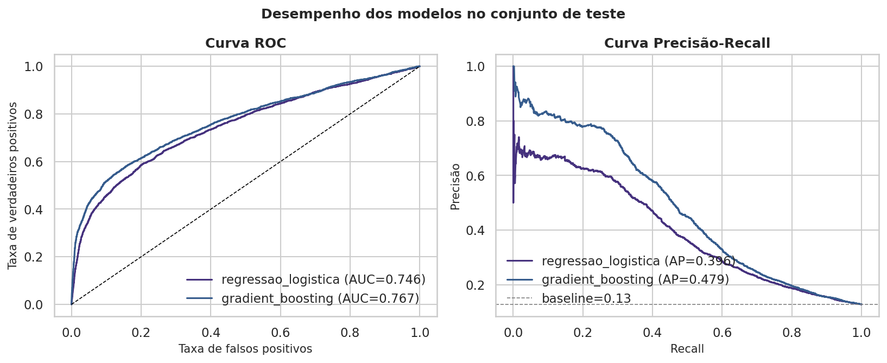

*Figura: Curvas ROC e Precisão-Recall no conjunto de teste*
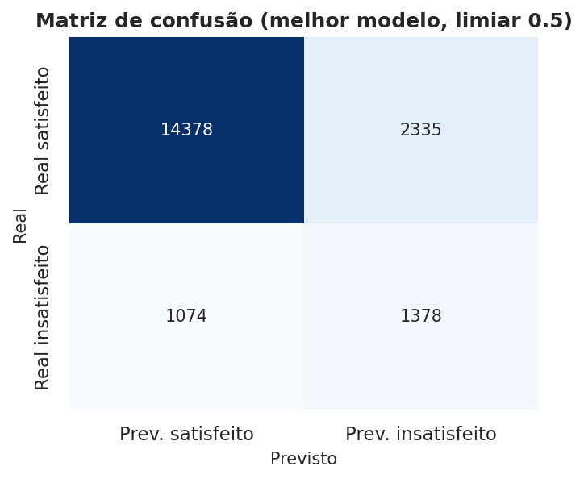

*Figura: Matriz de confusão do melhor modelo*
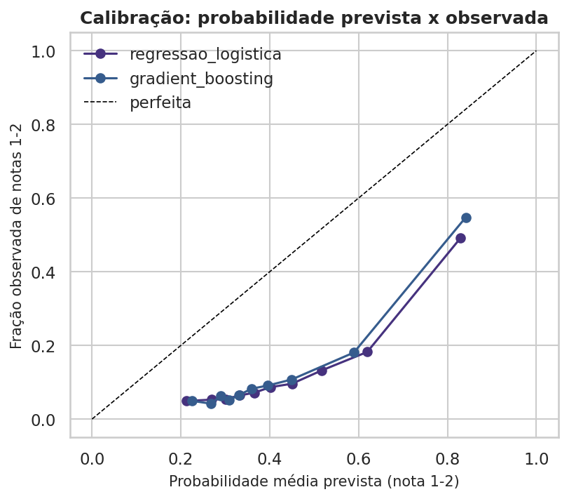

*Figura: Calibração das probabilidades previstas*

**Melhor modelo: `gradient_boosting`** — salvo em `outputs/modelo_insatisfacao.joblib`
(pronto para pontuar novos pedidos).

---

## 6. Avaliação e resultado final

### 6.1. Regressão logística — odds ratios

*Leitura: OR > 1 → **aumenta** a chance de nota 1-2; OR < 1 → **protege**.
Para variáveis numéricas o OR refere-se a 1 desvio-padrão; para categóricas,
compara-se à categoria de referência.*

**Top fatores de risco (OR > 1):**

| variavel                             | odds_ratio   |
|:-------------------------------------|:-------------|
| categoria: fashion_male_clothing     | 2,62         |
| entrega_dias                         | 2,10         |
| categoria: audio                     | 2,06         |
| UF vendedor: outros (agrupados)      | 1,74         |
| categoria: construction_tools_safety | 1,69         |
| categoria: art                       | 1,69         |
| categoria: sem_categoria             | 1,56         |
| categoria: home_confort              | 1,56         |

### 6.2. Regressão logística — fatores protetores (OR < 1)

| variavel                             | odds_ratio   |
|:-------------------------------------|:-------------|
| categoria: food_drink                | 0,12         |
| UF cliente: AP                       | 0,48         |
| categoria: books_general_interest    | 0,50         |
| categoria: construction_tools_lights | 0,56         |
| UF cliente: RR                       | 0,60         |
| UF vendedor: GO                      | 0,65         |
| categoria: christmas_supplies        | 0,67         |
| categoria: stationery                | 0,68         |

### 6.3. Gradient boosting — importância por permutação (queda média de AUC)

| variavel        | importancia_media   | importancia_std   |
|:----------------|:--------------------|:------------------|
| n_itens         | 0,0573              | 0,0021            |
| atraso_dias     | 0,0452              | 0,0015            |
| entrega_dias    | 0,0341              | 0,0032            |
| categoria_grupo | 0,0143              | 0,0011            |
| manuseio_dias   | 0,0074              | 0,0018            |
| uf_vendedor     | 0,0030              | 0,0011            |
| n_fotos         | 0,0027              | 0,0004            |
| distancia_km    | 0,0025              | 0,0005            |
| peso_g          | 0,0022              | 0,0007            |
| frete_total     | 0,0018              | 0,0006            |

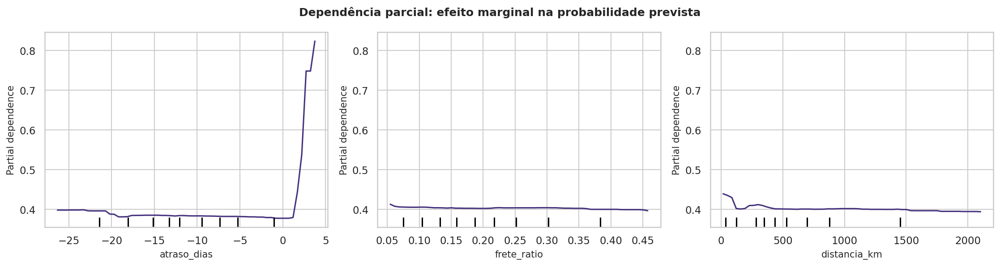

*Figura: Dependência parcial: atraso, frete e distância*

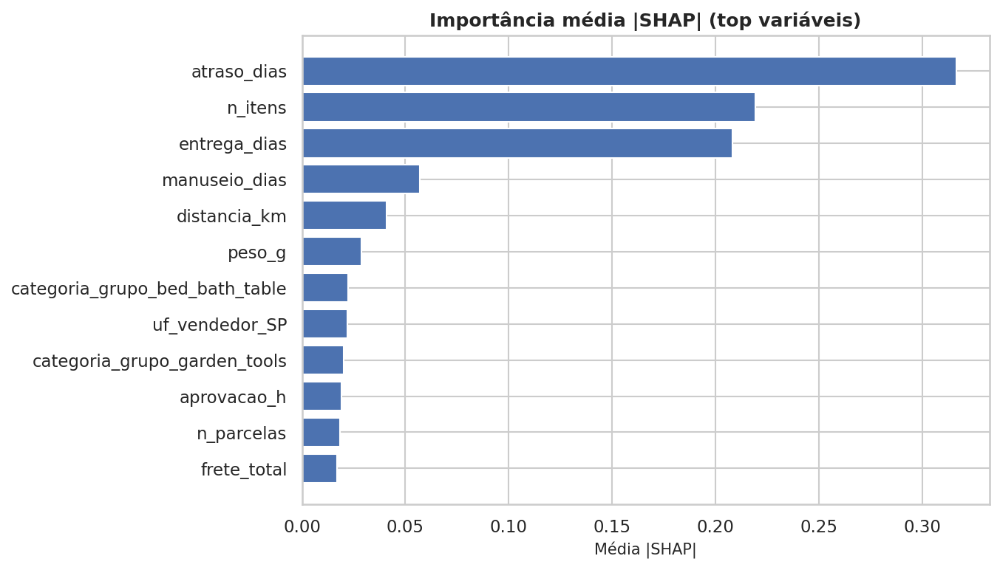

*Figura: Importância média |SHAP| no gradient boosting*
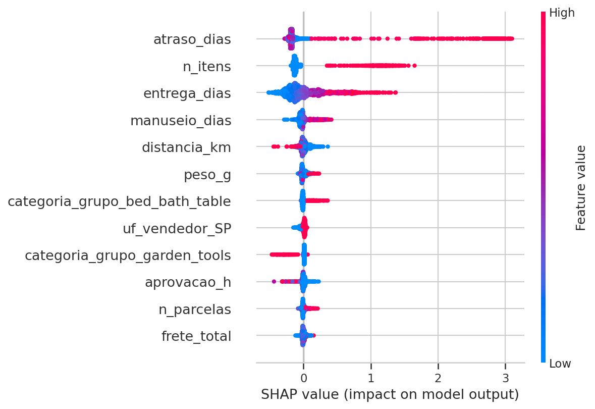

*Figura: SHAP beeswarm: direção e magnitude de cada variável*

### 6.4. Síntese do resultado

1. **O atraso é o fator dominante:** OR = 11,6x
   (IC95% 11,0–12,2) e relação
   dose-resposta monotônica nas faixas de atraso (Seção 3).
2. **`n_itens` é a variável mais importante no boosting** (permutação):
   11,3% de insatisfação em pedidos com
   1 item vs. 26,8% com 2+ itens.
3. **O modelo final (gradient_boosting)** atinge AUC = 0,767 e
   PR-AUC = 0,479 (baseline 0,128),
   viabilizando um **score de risco de insatisfação por pedido**.
4. **A forma de pagamento não se associou** ao alvo
   (qui-quadrado, p = 0,094)
   — exemplo de variável mantida por decisão de negócio, não por evidência.

### 6.5. Artefatos desta execução

| Arquivo | Conteúdo |
|---|---|
| `reports/relatorio_etapas.md` | este relatório |
| `reports/relatorio.md` | relatório executivo completo (EDA → recomendações) |
| `reports/tables/tab10_inventario_variaveis.csv` | inventário das 42 colunas |
| `reports/tables/tab11_descritivas_features.csv` | descritivas das 21 features |
| `reports/tables/tab12_correlacoes_numericas.csv` | matriz de correlação completa |
| `reports/tables/tab13_selecao_atributos.csv` | decisão + evidência por variável |
| `reports/tables/tab14_preprocessamento.csv` | resultado numérico de cada transformação |
| `outputs/analysis_dataset.csv` | base final (95.824 × 42) |
| `outputs/modelo_insatisfacao.joblib` | melhor modelo serializado |
| `outputs/resultados_modelo.json` | métricas e interpretações em JSON |

*Reprodutibilidade:* `python run_pipeline.py` (etapas `load → eda → tests → model →
etapas → report`) · seed 42 · dados: Kaggle `olistbr/brazilian-ecommerce`.
